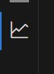
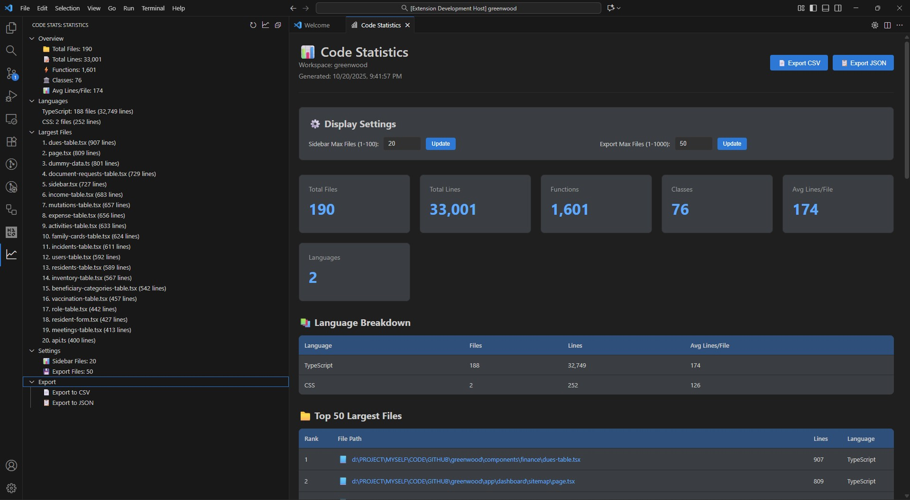
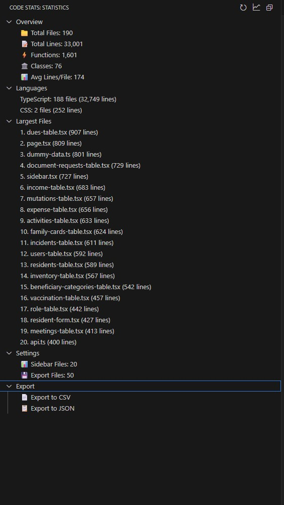
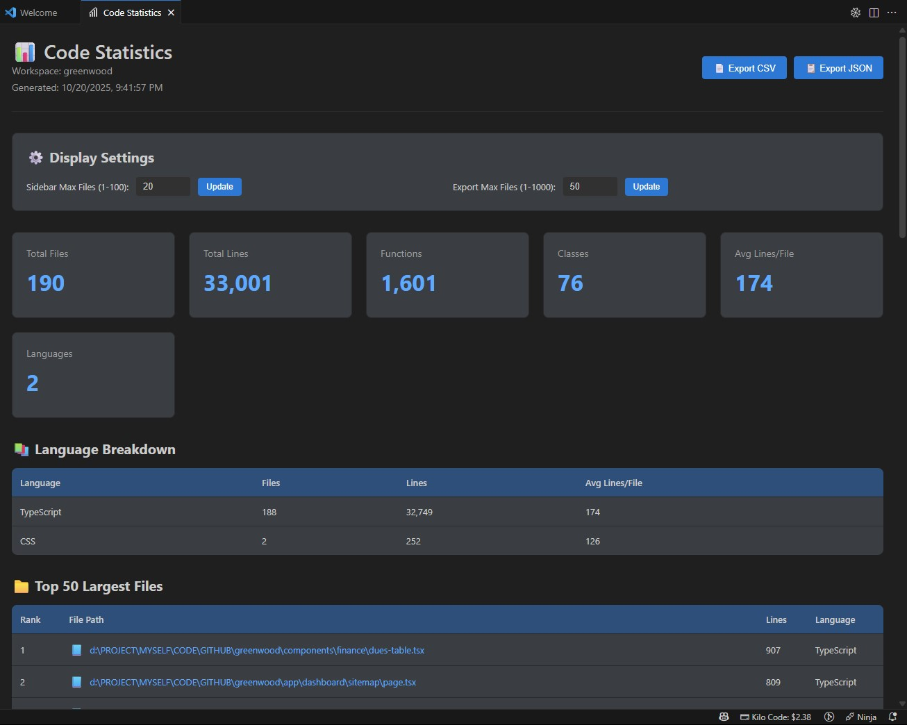

# Code Stats Viewer

<p align="center">
  
</p>

<p align="center">
  📊 A powerful VS Code extension for viewing real-time code statistics with export capabilities and custom filtering.
</p>

<p align="center">
  
</p>

## ✨ Features

- **📈 Real-time Statistics**: Automatically updates stats when files are saved, created, or deleted
- **🎯 Sidebar View**: Dedicated activity bar icon with 5 expandable sections (Overview, Languages, Largest Files, Settings, Export)
- **📊 Detailed Analytics**: View comprehensive stats in a beautiful webview with interactive elements
- **🖱️ Interactive UI**: 
  - Clickable file links with language icons (📜🐍☕🦀) to open files in editor
  - Configurable display settings directly in sidebar and webview
  - Input validation for all configuration changes
- **💾 Export Functionality**: Export your statistics to CSV or JSON formats with customizable file counts
- **🎨 Custom Filtering**: Configure which files and directories to include/exclude with wildcard pattern support
- **🌍 Multi-language Support**: Supports 19+ programming languages with visual icons
- **⚡ High Performance**: Optimized scanning for large projects with smart caching
- **🌙 Dark Mode Compatible**: Seamlessly integrates with VS Code themes (adaptive colors and icons)

## 🚀 Installation

### From VSIX (Local Installation)
1. Download the latest `.vsix` file
2. Open VS Code
3. Press `Ctrl+Shift+P` (or `Cmd+Shift+P` on Mac)
4. Type "Install from VSIX"
5. Select the downloaded file

### From Source
1. Clone this repository
2. Open the folder in VS Code
3. Press `F5` to launch Extension Development Host
4. Open any workspace to see statistics

## 📖 Usage

### Sidebar View

<p align="center">
  
</p>

1. Click the graph icon (📊) in the Activity Bar
2. View five expandable sections:
   - **Overview**: Total files, lines, functions, classes, and averages
   - **Languages**: Top 10 languages by line count
   - **Largest Files**: Configurable number of largest files (click to open)
   - **Settings**: Quick access to configure display options
   - **Export**: Quick export buttons for CSV and JSON

```
Code Stats
├─ 📊 Overview
│  ├─ 📁 Total Files: 145
│  ├─ 📝 Total Lines: 15,432
│  ├─ ⚡ Functions: 1,234
│  ├─ 🏛️ Classes: 89
│  └─ 📊 Avg Lines/File: 106
├─ 📚 Languages
│  ├─ JavaScript: 45 files (8,234 lines)
│  ├─ TypeScript: 32 files (5,123 lines)
│  └─ ...
├─ 📁 Largest Files
│  ├─ 1. main.js (543 lines)
│  └─ ...
├─ ⚙️ Settings
│  ├─ 📊 Sidebar Files: 10
│  └─ 💾 Export Files: 20
└─ 💾 Export
   ├─ 📄 Export to CSV
   └─ 📋 Export to JSON
```

### Detailed View

<p align="center">
  
</p>

- Click the graph icon in the sidebar title bar
- Or use Command Palette: `Code Stats: Show Detailed Statistics`
- View comprehensive analytics with:
  - **Display Settings**: Configure sidebar and export file limits directly in the UI
  - **Stats Cards**: 6 key metrics (files, lines, functions, classes, averages, languages)
  - **Language Breakdown Table**: Detailed statistics per programming language
  - **Top Largest Files Table**: Clickable file links with language icons
- Export directly from the detailed view with one click
- Interactive file links - click any file path to open it in the editor

### Export Formats

#### CSV Export Example
```csv
Code Statistics Export

Summary Metrics
Metric,Value
Total Files,145
Total Lines,15432
Total Functions,1234
Total Classes,89
Average Lines per File,106
Workspace,my-project
Export Date,2024-01-15T10:30:00.000Z

Language Breakdown
Language,Files,Lines,Avg Lines per File
JavaScript,45,8234,183
TypeScript,32,5123,160
...

Largest Files
Rank,File Path,Lines,Language
1,/path/to/main.js,543,JavaScript
2,/path/to/app.ts,489,TypeScript
...
```

#### JSON Export Example
```json
{
  "exportDate": "2024-01-15T10:30:00.000Z",
  "workspace": "my-project",
  "summary": {
    "totalFiles": 145,
    "totalLines": 15432,
    "totalFunctions": 1234,
    "totalClasses": 89,
    "avgLinesPerFile": 106
  },
  "languageBreakdown": [
    {
      "language": "JavaScript",
      "files": 45,
      "lines": 8234,
      "avgLinesPerFile": 183
    }
  ],
  "largestFiles": [
    {
      "rank": 1,
      "path": "/path/to/main.js",
      "lines": 543,
      "language": "JavaScript"
    }
  ]
}
```

## ⚙️ Configuration

### Settings

Access settings via:
- `File > Preferences > Settings > Extensions > Code Stats Viewer`
- **Sidebar**: Click items in the "Settings" section
- **Detailed View**: Use the "Display Settings" panel at the top

#### `codeStatsViewer.excludeDirs`
Array of directory names to exclude from analysis.

**Default:**
```json
[
  "node_modules",
  ".git",
  "dist",
  "build",
  "coverage",
  ".vscode",
  ".next",
  "out",
  "vendor"
]
```

#### `codeStatsViewer.excludePatterns`
Array of file patterns to exclude. Supports `*` (any characters) and `?` (single character) wildcards.

**Default:**
```json
[
  "*.min.js",
  "*.min.css",
  "*.map"
]
```

**Examples:**
- `*.test.js` - Exclude all test files
- `temp-*` - Exclude files starting with "temp-"
- `*.min.*` - Exclude all minified files
- `test?.js` - Exclude test1.js, test2.js, etc.

#### `codeStatsViewer.includedExtensions`
Array of file extensions to include in analysis.

**Default:**
```json
[
  ".js", ".ts", ".jsx", ".tsx", ".py", ".java",
  ".c", ".cpp", ".cs", ".php", ".rb", ".go",
  ".rs", ".swift", ".kt", ".dart", ".vue",
  ".svelte", ".html", ".css", ".scss"
]
```

#### `codeStatsViewer.maxLargestFilesSidebar`
Maximum number of largest files to show in sidebar (1-100).

**Default:** `10`

#### `codeStatsViewer.maxLargestFilesExport`
Maximum number of largest files to include in exports and detailed view (1-1000).

**Default:** `20`

### Example Configurations

#### React/Next.js Project
```json
{
  "codeStatsViewer.excludeDirs": [
    "node_modules",
    ".next",
    "out",
    "build",
    ".vercel"
  ],
  "codeStatsViewer.excludePatterns": [
    "*.min.js",
    "*.test.js",
    "*.spec.js"
  ]
}
```

#### Python Project
```json
{
  "codeStatsViewer.excludeDirs": [
    "__pycache__",
    "venv",
    ".venv",
    "dist",
    "build",
    "*.egg-info"
  ],
  "codeStatsViewer.excludePatterns": [
    "*.pyc",
    "test_*.py"
  ],
  "codeStatsViewer.includedExtensions": [
    ".py",
    ".pyx"
  ]
}
```

#### Java/Spring Project
```json
{
  "codeStatsViewer.excludeDirs": [
    "target",
    ".gradle",
    "build",
    "bin"
  ],
  "codeStatsViewer.excludePatterns": [
    "*Test.java",
    "*.class"
  ],
  "codeStatsViewer.includedExtensions": [
    ".java",
    ".kt"
  ]
}
```

## 🎯 Commands

| Command | Description | Keyboard Shortcut |
|---------|-------------|-------------------|
| `Code Stats: Show Detailed Statistics` | Open detailed view with interactive UI | - |
| `Code Stats: Refresh Statistics` | Manually refresh stats | - |
| `Code Stats: Export to CSV` | Export statistics to CSV | - |
| `Code Stats: Export to JSON` | Export statistics to JSON | - |
| `Code Stats: Change Sidebar Max Files` | Change max files shown in sidebar | - |
| `Code Stats: Change Export Max Files` | Change max files in exports | - |

Access commands via Command Palette (`Ctrl+Shift+P` or `Cmd+Shift+P`)

## 🌍 Supported Languages

The extension automatically detects and analyzes these languages:

- JavaScript (.js, .jsx)
- TypeScript (.ts, .tsx)
- Python (.py)
- Java (.java)
- C (.c)
- C++ (.cpp, .cc, .cxx)
- C# (.cs)
- PHP (.php)
- Ruby (.rb)
- Go (.go)
- Rust (.rs)
- Swift (.swift)
- Kotlin (.kt)
- Dart (.dart)
- Vue (.vue)
- Svelte (.svelte)
- HTML (.html)
- CSS (.css)
- SCSS (.scss)

## 💡 Use Cases

### Project Analysis
- **Code Review**: Quickly assess project size and complexity
- **Technical Debt**: Identify large files that need refactoring
- **Language Distribution**: Understand tech stack composition

### Team Reporting
- **Sprint Reports**: Export weekly code statistics
- **Documentation**: Include stats in project documentation
- **Presentations**: Visual data for stakeholder meetings

### Personal Tracking
- **Learning Progress**: Track lines written while learning
- **Productivity**: Monitor coding output over time
- **Portfolio**: Include project statistics in portfolio

## 🔧 Troubleshooting

### Statistics not updating?
- Click the refresh button in the sidebar
- Check if your files are in excluded directories
- Verify file extensions are in `includedExtensions` setting

### Export not working?
- Ensure you have write permissions in the target directory
- Check if the workspace folder is accessible
- Try exporting to a different location

### Performance issues with large projects?
- Add more directories to `excludeDirs` (e.g., `vendor`, `tmp`)
- Exclude unnecessary file patterns
- Consider limiting `includedExtensions` to relevant types

### Missing languages?
- Check if file extension is in `includedExtensions`
- Verify file is not excluded by patterns
- Language detection is based on file extension

## 📊 Performance

The extension is optimized for large projects:

- **Scanning Speed**: ~2 seconds for 1,000 files
- **Refresh Speed**: < 500ms for cached data
- **Memory Usage**: Minimal footprint with smart caching
- **Background Processing**: Non-blocking workspace analysis

## 🐛 Known Issues

- Very large files (>10MB) may take longer to analyze
- Binary files are skipped automatically
- Symlinks are not followed to prevent circular references

## 📝 FAQ

**Q: Can I add custom file extensions?**  
A: Yes! Add them to `codeStatsViewer.includedExtensions` in settings.

**Q: How do I exclude test files?**  
A: Add patterns like `*.test.js` or `*.spec.ts` to `excludePatterns`.

**Q: Does it work with monorepos?**  
A: Yes! Just configure `excludeDirs` to skip unwanted packages.

**Q: Can I export multiple times?**  
A: Yes! Each export includes a timestamp in the filename.

**Q: Does it count comments as lines?**  
A: Yes, currently all non-empty lines are counted including comments.

## 🔄 Changelog

### Version 1.1.0
- ✨ Added custom exclude patterns support
- ✨ Added configurable file extensions
- ✨ Added Settings section in sidebar with clickable configuration
- ✨ Added Display Settings panel in detailed view
- ✨ Added configurable max files for sidebar and exports
- 🎨 Added language icons (📜🐍☕🦀 etc.) for better visual identification
- 🎨 Added clickable file links in detailed view to open files in editor
- 🎨 Added custom tab icon for Code Statistics view
- 🎨 Improved webview styling with better dark mode support
- ⚡ Performance optimizations for large projects
- 🐛 Fixed auto-refresh issues
- 📚 6 new commands for quick access to settings

### Version 1.0.0
- 🎉 Initial release
- 📊 Real-time sidebar statistics
- 💾 CSV and JSON export
- 🌍 Multi-language support (19+ languages)
- 🎯 Detailed webview with comprehensive analytics

## 📄 License

MIT License - feel free to use in your projects!

## 🤝 Contributing

Contributions are welcome! Please feel free to submit issues and pull requests.

## 💬 Support

If you encounter any issues or have suggestions:
1. Check the Troubleshooting section
2. Review existing GitHub issues
3. Create a new issue with details

---

**Enjoy analyzing your code! 📊✨**
